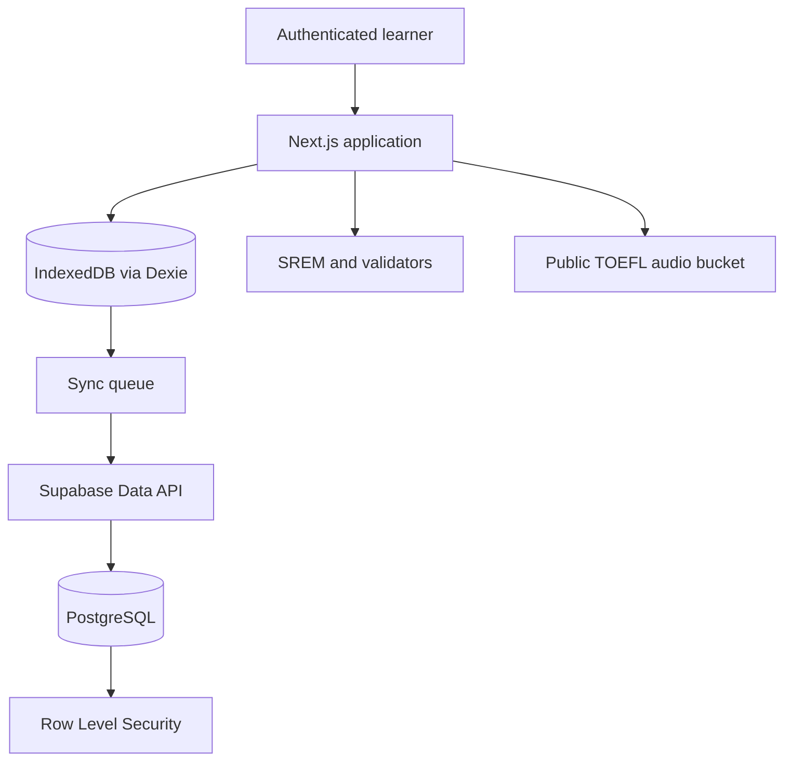

# Macitta architecture

Last verified: 2026-06-28.

Macitta is an offline-first study application. The browser remains usable during a connection loss, while Supabase provides identity, durable cloud persistence and TOEFL audio storage.

## Repository layout

```text
apps/web/              Next.js 15 application and PWA
packages/shared/       SREM, validation, TOEFL scoring and unit tests
supabase/migrations/   Complete production migration history
supabase/seed-assets/  Reproducible Storage fixtures
docs/                  Algorithm and deployment documentation
```

The root uses npm workspaces and Turborepo. Shared learning logic does not import React or Next.js, so it can be tested and reused independently from the interface.

## Runtime boundaries



### Web application

The App Router separates marketing, authentication and authenticated product routes. The main product areas are:

- `/dashboard`: next action, progress and recent activity.
- `/estudio/global`: due cards across all decks.
- `/vocabulario`: personal decks, cards and import tools.
- `/toefl`: Reading, Grammar and Listening practice plus attempt history.
- `/usuario`: profile, security and personal statistics.

### Local persistence

Dexie stores study content, SREM state, sessions, TOEFL attempts and queued writes. User actions write locally first when needed. The sync layer replays pending operations when connectivity returns.

The dock is responsible for presenting real network and synchronization state. Product screens must not show a hard-coded “synced” state.

### Supabase

Supabase provides:

- Auth and the `profiles` trigger.
- PostgreSQL data for decks, cards, progress, sessions and TOEFL.
- RLS policies that keep progress and attempts private to the authenticated owner.
- A public `toefl-audio` bucket for known Listening asset URLs.

The migration directory now matches the linked production history. New changes must use `supabase migration new`, pass a dry-run and be represented in Git before being applied remotely.

## Learning model

### SREM

`packages/shared/src/sem.ts` defines the growth curve:

```text
[0, 1, 3, 7, 16, 35, 75, 150, 365]
```

Position 0 represents a new card. Positions 1 through 8 represent scheduled intervals through mastery. Difficulty modifies the resulting interval, while Hard and Again recalibrate progress without allowing uncontrolled interval growth.

The engine records:

- `step` and `interval`
- `difficulty`
- repetitions and lapses
- due date
- learning state: `new`, `learning`, `review` or `mastered`

### TOEFL

TOEFL content is stored in `exams` and `questions`. Attempts and per-question answers are stored separately and protected by owner-based RLS.

Two modes share the same scoring function:

- Flexible: free navigation and full audio controls.
- Strict: countdown, forward-only navigation, automatic submission and one-pass Listening audio.

Results are persisted locally before cloud synchronization. The review page can build a contextual tutor prompt from selected answers; it does not call or transmit content to an AI provider.

## Security model

- Client code only receives the public Supabase URL and publishable or legacy anon key.
- Exposed application tables use RLS.
- User-owned rows compare ownership against `(select auth.uid())`.
- `handle_new_user` is a private trigger function and cannot be called by `anon` or `authenticated` through the Data API.
- The public audio bucket does not grant a broad listing policy.
- Secret or `service_role` keys must never use a `NEXT_PUBLIC_` variable.

Supabase leaked-password protection remains a project setting and may require a paid plan. The application enforces an eight-character minimum in signup and password changes.

## Verification gates

Before promoting `develop`:

```bash
npm run lint
npm run test
npm run build
npx supabase migration list --linked
npx supabase db lint --linked
npx supabase db advisors --linked --type security --level warn --fail-on none
```

Visual verification covers mobile, tablet and desktop for dashboard, TOEFL list, practice, results, profile and empty/error states.

## Current product status

The current portfolio release includes custom decks, global spaced-repetition study, offline queuing, analytics, PWA installation and TOEFL practice across all three supported sections. The immediate release focus is reliability and clarity, not adding another feature family.
