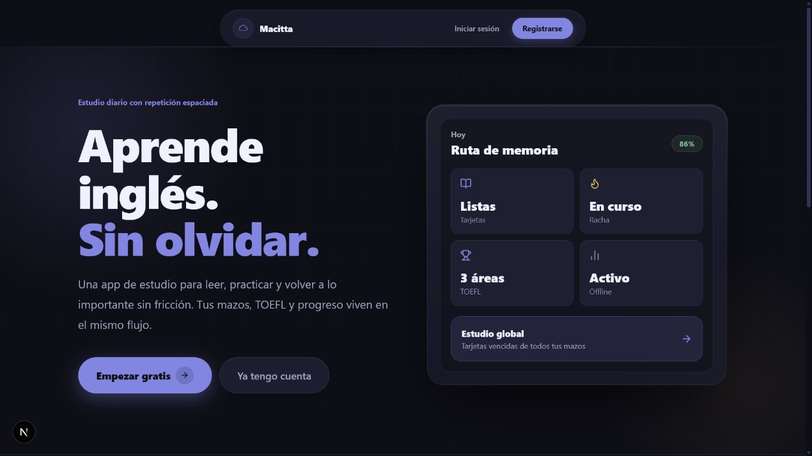
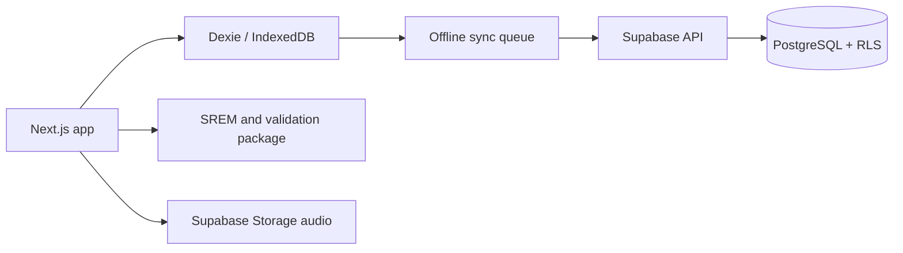

<div align="center">

# Macitta

**Offline-first English study, spaced repetition and TOEFL practice in one installable app.**

[Live app](https://www.macitta.app) · [Architecture](ARCHITECTURE.md) · [SREM algorithm](docs/srem-algorithm.md) · [Deployment guide](docs/deployment.md)

[](https://nextjs.org/)
[](https://www.typescriptlang.org/)
[](https://supabase.com/)
[](packages/shared/src)
[](LICENSE)

</div>



## Why this project exists

Engineering and robotics students often need English before they can comfortably read documentation, understand errors or prepare for international exams. Macitta turns that need into short study sessions that continue working with an unreliable connection.

This repository is also an engineering case study. It combines a custom scheduling algorithm, an offline queue, typed application code, database security, automated tests and a deployed product.

## Product capabilities

| Area | What is implemented |
|---|---|
| Spaced repetition | Custom SREM engine with a 9-position growth curve, difficulty adjustment and lapse-aware progression |
| Study sessions | Global due-card queue, personal decks, answer validation and activity tracking |
| TOEFL | Reading, Grammar and Listening, flexible and strict modes, scoring, review history and AI tutor prompt generation |
| Offline support | PWA shell, IndexedDB persistence with Dexie and a replayable Supabase sync queue |
| Data security | Supabase Auth, RLS on exposed application tables and private user progress |
| Quality | TypeScript strict mode, ESLint, production build checks and 69 automated tests |

## Architecture at a glance



- `apps/web`: Next.js App Router, authentication, study flows and PWA.
- `packages/shared`: framework-independent SREM, scoring, validation and tests.
- `supabase/migrations`: complete migration history fetched from the linked production database.
- `supabase/seed-assets`: versioned TOEFL audio required by the seed content.

See [ARCHITECTURE.md](ARCHITECTURE.md) for data flow, security boundaries and current product status.

## Run locally

Prerequisites: Node.js 20+, npm and a Supabase project.

```bash
git clone https://github.com/angelgit3/macitta.git
cd macitta
npm install
```

Copy the environment template and add the URL and publishable or legacy anon key from your Supabase project:

```bash
cp apps/web/.env.example apps/web/.env.local
```

Link the project, apply the versioned schema and upload the two TOEFL audio fixtures:

```bash
npx supabase login
npx supabase link --project-ref YOUR_PROJECT_REF
npx supabase db push
npx supabase storage cp --experimental --linked --recursive supabase/seed-assets/toefl-audio ss:///toefl-audio
```

Then start the app:

```bash
npm run dev
```

Open [http://localhost:3000](http://localhost:3000). The full setup, Auth redirect configuration and deployment checklist are in [docs/deployment.md](docs/deployment.md).

## Verify a change

```bash
npm run lint
npm run test
npm run build
npx supabase db lint --linked
npx supabase db advisors --linked --type security --level warn --fail-on none
```

The production database currently passes schema lint. Supabase may still report leaked-password protection as unavailable when the project is on a plan that does not include that feature.

## Branches and contributions

- `main` contains the public release.
- `develop` is the integration branch.
- Feature work should branch from and return to `develop`.

See [CONTRIBUTING.md](CONTRIBUTING.md) before opening a pull request.

## License

MIT. See [LICENSE](LICENSE).

Built in Mexico as an open-source learning tool and software engineering portfolio project.
