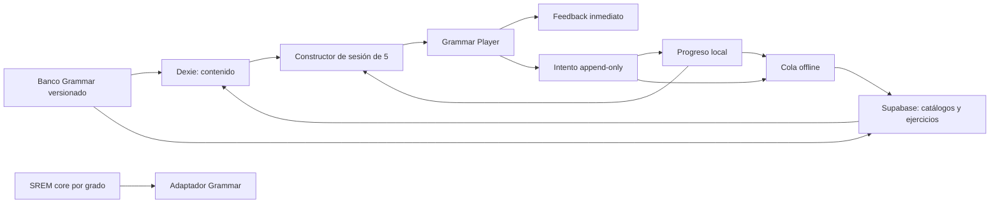

# Design: pulir-grammar

## 1. Arquitectura



El contenido es estático y versionado. Los intentos son eventos inmutables. El
progreso es una proyección mutable que permite construir la cola rápidamente.

## 2. Límites de dominio

### Compartido

- Curva, estados y transición SREM.
- Utilidades de fechas.
- Tipos base de estado.

### Específico de tarjetas

- Cálculo de exactitud por slots.
- Umbrales de tiempo.
- Carga de cards y card slots.

### Específico de Grammar

- Respuesta binaria.
- Payload completion/error identification.
- Taxonomía.
- Cola de cinco.
- Feedback por distractor.
- Progreso por habilidad.

## 3. Refactor previsto de SREM

La implementación actual une cálculo de grado y transición en `evaluateSEM`.
Debe introducirse una API que permita aplicar un grado explícito:

```ts
applySEMGrade(currentState, {
  grade,
  accuracy,
  reviewedAt,
})
```

Los adaptadores quedan:

```ts
evaluateCardReview(state, slotAccuracy, timeMs)
evaluateGrammarReview(state, isCorrect)
```

Las pruebas existentes deben demostrar que el adaptador de tarjetas conserva
exactamente el comportamiento actual.

En V1, Grammar mapea:

```ts
isCorrect ? SEMGrade.Good : SEMGrade.Again
```

## 4. Modelo de contenido

```ts
type GrammarExerciseFormat =
  | "sentence_completion"
  | "error_identification";

type CompletionPrompt = {
  kind: "sentence_completion";
  before: string;
  after: string;
  options: Array<{
    id: "A" | "B" | "C" | "D";
    text: string;
    misconceptionCode?: string;
    feedback?: string;
  }>;
};

type ErrorIdentificationPrompt = {
  kind: "error_identification";
  segments: Array<{
    text: string;
    optionId?: "A" | "B" | "C" | "D";
  }>;
};
```

Reglas:

- `kind` coincide con `format`.
- Completion tiene exactamente cuatro opciones y un solo blank lógico.
- Error identification tiene exactamente cuatro `optionId`.
- `correct_option_id` siempre pertenece a A–D.
- La explicación y oración corregida viven fuera del payload para que sean
  obligatorias y fáciles de auditar.

## 5. Esquema lógico

### `grammar_domains`

- `id uuid primary key`
- `code text unique not null`
- `name_es text not null`
- `order_index smallint not null`

### `grammar_skills`

- `id uuid primary key`
- `domain_id uuid not null references grammar_domains`
- `code text unique not null`
- `name_es text not null`
- `description_es text not null`
- `cefr_min text not null`
- `order_index smallint not null`
- `is_active boolean not null default true`

### `grammar_exercises`

- `id uuid primary key`
- `primary_skill_id uuid not null references grammar_skills`
- `format text not null`
- `cefr_band text not null`
- `difficulty smallint not null`
- `prompt jsonb not null`
- `correct_option_id text not null`
- `corrected_sentence text not null`
- `explanation_es text not null`
- `status text not null`
- `content_version integer not null`
- `source_note text`
- `created_at timestamptz not null`
- `updated_at timestamptz not null`

Checks:

- formatos conocidos;
- CEFR A2–C1 para el banco ITP Level 1;
- dificultad 1–3;
- clave A–D;
- estado draft/review/published/retired;
- versión positiva.

### `grammar_exercise_skills`

- `exercise_id uuid references grammar_exercises`
- `skill_id uuid references grammar_skills`
- `weight real not null`
- primary key `(exercise_id, skill_id)`

Solo contiene habilidades secundarias; la primaria está en
`grammar_exercises.primary_skill_id`.

### `grammar_user_progress`

- primary key `(user_id, exercise_id)`
- estado SREM no nullable;
- contadores no negativos;
- `revision integer not null default 1`;
- timestamps con zona horaria.

### `grammar_sessions`

- UUID generado en cliente;
- propietario;
- tipo de sesión;
- timestamps;
- totales finales.

### `grammar_attempts`

- UUID generado en cliente;
- foreign keys a usuario, ejercicio y sesión;
- selección;
- corrección;
- grado;
- estado anterior/posterior;
- duración;
- versión de contenido;
- timestamps.

Los intentos son append-only para clientes normales.

## 6. Consultas principales

### Cola

1. Buscar progreso vencido del usuario ordenado por `due_at`.
2. Enriquecer con ejercicio, habilidad primaria y dominio.
3. Aplicar diversidad local.
4. Consultar nuevos solo para completar el grupo.

Índice principal:

```sql
create index grammar_user_progress_user_due_idx
on public.grammar_user_progress (user_id, due_at);
```

No se deben añadir índices especulativos antes de verificar las consultas con
`EXPLAIN`.

### Progreso por habilidad

Agregar sobre progreso visto y catálogo publicado. Para evitar N+1, cargar en una
consulta agrupada o una función SQL cuidadosamente protegida. Si se crea una
vista expuesta, debe usar `security_invoker = true`.

## 7. RLS

Catálogos:

- `SELECT TO authenticated USING (true)`.
- Escritura solo por migraciones o backend administrativo, nunca por cliente.

Datos de usuario:

```sql
to authenticated
using ((select auth.uid()) = user_id)
with check ((select auth.uid()) = user_id)
```

El upsert de progreso necesita `SELECT`, `INSERT` y `UPDATE`. Los intentos solo
necesitan `SELECT` e `INSERT` para el usuario. `user_id` debe estar indexado.

## 8. Offline y conflictos

Dexie añadirá:

- `grammarDomains`;
- `grammarSkills`;
- `grammarExercises`;
- `grammarProgress`;
- `grammarSessions`;
- `grammarAttempts`.

Operaciones de sync:

- `insert_grammar_attempt`;
- `upsert_grammar_progress`;
- `start_grammar_session`;
- `finish_grammar_session` con estado `completed` o `abandoned`.

El `attempt.id` hace idempotente el reintento. `grammarProgress.revision` permite
detectar dos dispositivos. Si la revisión remota es mayor, el cliente no debe
sobrescribir silenciosamente: recupera intentos faltantes y reconstruye.

## 9. Constructor de sesión

Entrada:

- usuario;
- fecha actual;
- filtro opcional de habilidad;
- modo;
- tamaño 5.

Salida:

- IDs ordenados;
- razón de inclusión por ejercicio;
- snapshot de versión de contenido.

El algoritmo debe ser una función pura y probada con fixtures:

1. partir vencidos y nuevos;
2. llenar vencidos por antigüedad/debilidad;
3. añadir nuevos hasta completar el grupo; un usuario nuevo recibe cinco si el
   catálogo tiene suficiente contenido;
4. imponer diversidad sin descartar vencidos críticos;
5. aproximar mezcla de formatos;
6. aplicar jitter determinista con usuario + fecha + número de sesión.

La razón de inclusión facilita depuración:

- `overdue`;
- `lapse`;
- `weak_skill`;
- `new`;
- `maintenance`;
- `focused_practice`.

## 10. Estados UX

| Estado interno | Estado visible |
|---|---|
| step 0 | Nuevo |
| step 1 | Aprendiendo |
| step 2–7 | Completado |
| step 8 | Dominado |
| due_at vencido | Toca repasar |

Un ejercicio puede ser “Completado” y “Toca repasar” simultáneamente. La UI debe
explicarlo como mantenimiento, no como pérdida del logro.

## 11. Errores y contenido retirado

- Un ejercicio `retired` no se entrega en sesiones nuevas.
- Sus intentos permanecen.
- Su progreso no se borra.
- Si cambia la clave, se crea una nueva versión y se marca para recalcular
  métricas; no se reescribe silenciosamente el pasado.
- La UI de historial muestra la versión respondida.

## 12. Pruebas

### Unitarias

- Transición SREM por grado.
- Compatibilidad del adaptador de tarjetas.
- Adaptador binario de Grammar.
- Dos Good espaciados producen Completado.
- Un retry inmediato no adelanta.
- Constructor de cola y diversidad.
- Validadores de ambos payloads.
- Agregación por habilidad.

### Integración

- RLS de catálogos y progreso.
- Upsert idempotente.
- Intento duplicado no duplica logs.
- Sincronización offline.
- Conflicto de revisión.
- Contenido retirado no entra en cola.

### E2E

- Completar un grupo de cinco.
- Error con feedback.
- Continuar con otros cinco.
- Ejercicio pasa a Completados.
- Ejercicio vencido reaparece.
- Navegación por teclado y lector de pantalla.
- Recuperación después de perder conexión.

## 13. Migración

1. Crear tablas nuevas sin alterar las actuales.
2. Publicar catálogo completo de 350 ejercicios.
3. Activar la ruta principal de Grammar.
4. No migrar automáticamente los siete ejercicios existentes.
5. Mantener historial TOEFL antiguo como solo lectura.
6. Tras validar, redirigir la entrada principal de Grammar.
7. Decidir posteriormente si se conserva el simulador actual como función
   secundaria.
